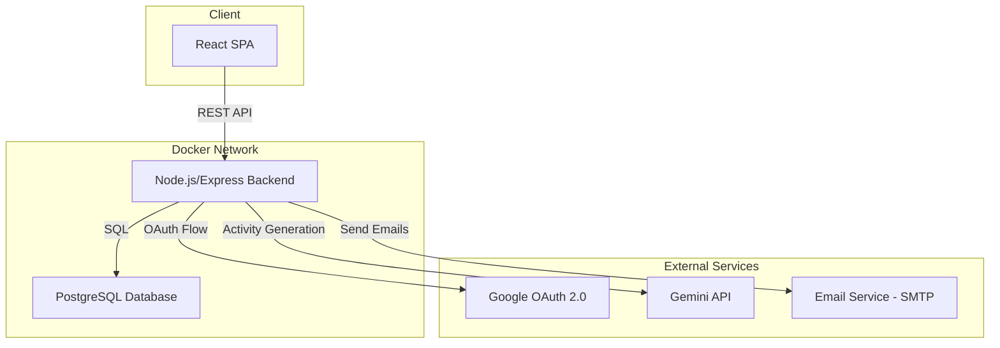
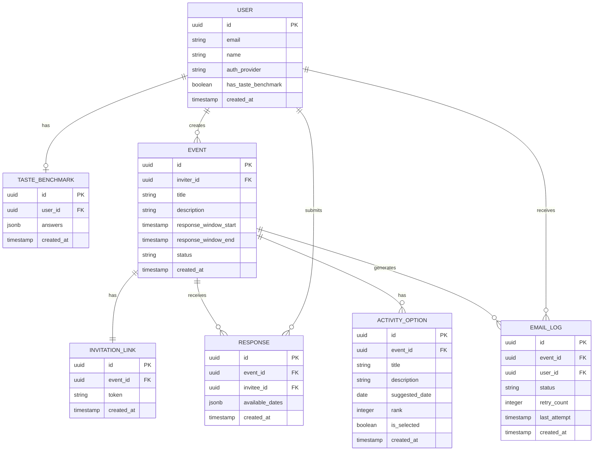

# Design Document: Go Fish

## Overview

Go Fish is a web application that helps groups find shared activities matching everyone's preferences and availability. The system follows a flow: an Inviter creates an event → shares an invitation link → Invitees respond with preferences and availability → a Gemini AI agent analyzes responses → generates three activity options → the Inviter picks one → all participants receive email notification.

The application uses a React frontend, a Node.js/Express backend running in Docker, a PostgreSQL database in a separate Docker container, and integrates with Google's Gemini API for AI-powered activity suggestions.

## Architecture

The system follows a client-server architecture with containerized services.



### Key Architectural Decisions

1. **React SPA frontend**: Provides a responsive, interactive UI for event creation, invitation responses, and activity selection. Communicates with the backend via REST API.
2. **Node.js/Express backend**: Chosen per requirements (Req 9.1). Handles authentication, business logic, API routing, and orchestrates external service calls.
3. **PostgreSQL database**: Relational database well-suited for the structured data model (users, events, responses, activity options) with strong referential integrity.
4. **Docker Compose**: Orchestrates the backend and database containers on a shared Docker network (Req 9.2, 9.3).
5. **Gemini API**: Used as the Decision_Agent to analyze Taste_Benchmarks and availability, generating ranked activity options.
6. **SMTP email service**: Sends notification emails with retry logic.

## Components and Interfaces

### Frontend Components

| Component | Responsibility |
|---|---|
| `AuthPage` | Renders Google OAuth and email login options |
| `TasteBenchmarkForm` | 10-question checkbox form for first-time Invitees |
| `EventCreationForm` | Form for Inviter to create events with title and description |
| `InvitationLinkPanel` | Displays and copies the generated invitation link |
| `EventResponseForm` | Date selection interface for Invitees |
| `ActivityOptionsView` | Displays three ranked activity options for the Inviter |
| `EventConfirmation` | Shows the selected activity details |

### Backend Modules

| Module | Responsibility |
|---|---|
| `authRouter` | Handles Google OAuth 2.0 flow and email-based authentication |
| `eventRouter` | CRUD operations for events, invitation link generation |
| `responseRouter` | Invitee response submission and validation |
| `decisionAgent` | Interfaces with Gemini API to generate activity options |
| `emailService` | Sends notification emails with retry logic |
| `responseWindowScheduler` | Manages 24-hour response window timers |

### API Endpoints

| Method | Path | Description |
|---|---|---|
| `POST` | `/api/auth/google` | Initiate Google OAuth flow |
| `POST` | `/api/auth/email` | Initiate email-based login |
| `GET` | `/api/auth/session` | Get current session info |
| `POST` | `/api/events` | Create a new event |
| `GET` | `/api/events/:eventId` | Get event details |
| `POST` | `/api/events/:eventId/link` | Generate invitation link |
| `GET` | `/api/invite/:linkToken` | Resolve invitation link to event |
| `GET` | `/api/taste-benchmark` | Get current user's taste benchmark |
| `POST` | `/api/taste-benchmark` | Submit taste benchmark |
| `POST` | `/api/events/:eventId/responses` | Submit invitee response |
| `GET` | `/api/events/:eventId/responses` | Get responses (Inviter only) |
| `POST` | `/api/events/:eventId/generate` | Trigger activity generation |
| `GET` | `/api/events/:eventId/options` | Get generated activity options |
| `POST` | `/api/events/:eventId/select` | Select an activity option |


## Data Models

### Entity Relationship Diagram



### Model Details

**USER**: Stores authenticated users. `auth_provider` is either `"google"` or `"email"`. `has_taste_benchmark` is a denormalized flag for quick checks.

**TASTE_BENCHMARK**: Stores the 10-question checkbox answers as a JSONB object. Each key is a question identifier, each value is an array of selected options.

**EVENT**: Core entity. `status` transitions through: `collecting` → `generating` → `options_ready` → `finalized`. `response_window_end` is set to `response_window_start + 24 hours`.

**INVITATION_LINK**: One-to-one with Event. `token` is a cryptographically random URL-safe string used in the shareable link.

**RESPONSE**: Stores an Invitee's available dates for an Event. Unique constraint on `(event_id, invitee_id)` enforces one response per Invitee per Event.

**ACTIVITY_OPTION**: Stores the three AI-generated options. `rank` is 1-3 (1 = highest compatibility). `is_selected` marks the Inviter's choice.

**EMAIL_LOG**: Tracks email delivery attempts. `status` is one of: `pending`, `sent`, `failed`. `retry_count` maxes at 3 with 5-minute intervals.

### Key Constraints

- `RESPONSE` has a unique constraint on `(event_id, invitee_id)` — one response per Invitee per Event (Req 5.5)
- `INVITATION_LINK.token` has a unique index — each link maps to exactly one Event (Req 4.4)
- `ACTIVITY_OPTION` is limited to 3 per Event, with exactly one having `is_selected = true` after finalization (Req 7.3)
- `EMAIL_LOG.retry_count` is capped at 3 (Req 8.4)


## Correctness Properties

*A property is a characteristic or behavior that should hold true across all valid executions of a system — essentially, a formal statement about what the system should do. Properties serve as the bridge between human-readable specifications and machine-verifiable correctness guarantees.*

### Property 1: Failed authentication returns a non-empty error message

*For any* authentication attempt with invalid credentials (Google OAuth or email), the Auth_Service should return a response containing a non-empty, descriptive error message.

**Validates: Requirements 1.4**

### Property 2: Authenticated user redirect is role-based

*For any* authenticated user, the redirect destination after login should be the Inviter dashboard if the user arrived directly, or the Event response form if the user arrived via an Invitation_Link.

**Validates: Requirements 1.5**

### Property 3: Taste Benchmark gates Event response access

*For any* Invitee, accessing an Event response form should succeed if and only if the Invitee has a completed Taste_Benchmark. Invitees without a Taste_Benchmark should be redirected to the benchmark form.

**Validates: Requirements 2.1, 2.2, 2.4**

### Property 4: Taste Benchmark round trip

*For any* valid Taste_Benchmark submission (all 10 questions answered), storing it and then retrieving it by user ID should produce an equivalent set of answers.

**Validates: Requirements 2.3**

### Property 5: Incomplete Taste Benchmark is rejected with specific errors

*For any* Taste_Benchmark submission missing at least one question's answer, the Backend should reject the submission and return a validation error that identifies every unanswered question.

**Validates: Requirements 2.5**

### Property 6: Event creation persists with correct owner and window

*For any* valid event creation request (non-empty title and description) by an authenticated Inviter, the created Event should be retrievable with the same title and description, associated with the correct Inviter, and have a Response_Window ending exactly 24 hours after its start.

**Validates: Requirements 3.1, 3.2, 3.3**

### Property 7: Invalid event creation is rejected with field errors

*For any* event creation request missing a required field (title or description), the Backend should reject it and return a validation error listing every missing field.

**Validates: Requirements 3.4**

### Property 8: Invitation link uniqueness and resolution

*For any* two generated Invitation_Links (whether for the same or different Events), their tokens should be distinct. Furthermore, *for any* valid invitation token, resolving it should return exactly one Event.

**Validates: Requirements 4.1, 4.3, 4.4**

### Property 9: Response storage round trip

*For any* valid response submission (Invitee, Event, available dates) during an open Response_Window, storing it and then retrieving it should produce the same available dates associated with the correct Invitee and Event.

**Validates: Requirements 5.2**

### Property 10: Response acceptance depends on window state

*For any* Event and Invitee, submitting a response should succeed if the current time is within the Response_Window, and should be rejected with an appropriate message if the Response_Window has closed.

**Validates: Requirements 5.3, 5.4**

### Property 11: One response per Invitee per Event

*For any* Event and Invitee who has already submitted a response, attempting to submit a second response should be rejected, and the original response should remain unchanged.

**Validates: Requirements 5.5**

### Property 12: Activity option generation produces valid structured output

*For any* Event that triggers activity generation (either all Invitees responded or the Response_Window expired), the Decision_Agent should produce exactly three Activity_Options, each with a non-empty title, non-empty description, a valid suggested date, and a distinct rank in {1, 2, 3}.

**Validates: Requirements 6.1, 6.2, 6.3, 6.4**

### Property 13: Exactly one Activity_Option is selected per finalized Event

*For any* Event where the Inviter selects an Activity_Option, exactly one of the three options should be marked as selected, and the Event status should transition to `finalized`.

**Validates: Requirements 7.2, 7.3**

### Property 14: Finalization emails are sent to all respondents and Inviter with correct content

*For any* finalized Event, the system should send an email to every Invitee who submitted a response plus the Inviter. Each email should contain the selected activity's title, description, and date.

**Validates: Requirements 8.1, 8.2, 8.3**

### Property 15: Email retry count does not exceed three

*For any* failed email delivery attempt, the system should retry up to three times. After three failed retries, the email status should be `failed` and no further retries should be attempted.

**Validates: Requirements 8.4**

### Property 16: Database connection retry does not exceed five

*For any* database connection failure, the Backend should retry up to five times with a 3-second interval between attempts. After five failed retries, the Backend should log an error and stop retrying.

**Validates: Requirements 9.5**


## Error Handling

### Authentication Errors

- **Invalid OAuth callback**: Return 401 with a message describing the OAuth failure reason (e.g., "Google authentication was denied" or "OAuth token expired").
- **Invalid email verification**: Return 401 with "Email verification failed. Please try again."
- **Session expired**: Return 401 with "Session expired. Please log in again." Frontend redirects to login page.

### Validation Errors

- **Incomplete Taste Benchmark**: Return 400 with `{ error: "incomplete_benchmark", missingQuestions: ["q3", "q7"] }`.
- **Missing event fields**: Return 400 with `{ error: "missing_fields", fields: ["title"] }`.
- **Empty/invalid response dates**: Return 400 with `{ error: "invalid_dates", message: "At least one available date is required." }`.

### Business Logic Errors

- **Response after window closed**: Return 403 with `{ error: "window_closed", message: "The response period for this event has ended." }`.
- **Duplicate response**: Return 409 with `{ error: "duplicate_response", message: "You have already submitted a response for this event." }`.
- **Duplicate activity selection**: Return 409 with `{ error: "already_finalized", message: "An activity has already been selected for this event." }`.
- **Invalid invitation link**: Return 404 with `{ error: "invalid_link", message: "This invitation link is not valid." }`.

### External Service Errors

- **Gemini API failure**: Log the error, return 503 to the Inviter with "Activity generation is temporarily unavailable. Please try again shortly." Implement exponential backoff retry (up to 3 attempts).
- **Email delivery failure**: Log to EMAIL_LOG, retry up to 3 times at 5-minute intervals. After exhausting retries, mark as `failed` in EMAIL_LOG.
- **Database connection failure**: Retry up to 5 times at 3-second intervals. After exhausting retries, log error and return 503 for any incoming requests.

## Testing Strategy

### Property-Based Testing

Property-based tests validate the correctness properties defined above using generated inputs. Use **fast-check** as the property-based testing library with **Vitest** as the test runner.

Each property test must:
- Run a minimum of 100 iterations
- Reference its design document property with a tag comment
- Tag format: `Feature: go-fish, Property {number}: {property_text}`

Property tests cover:
- **Authentication**: Error message presence on failure, role-based redirects (Properties 1, 2)
- **Taste Benchmark**: Gating logic, round-trip storage, incomplete submission rejection (Properties 3, 4, 5)
- **Event lifecycle**: Creation persistence with owner/window, validation errors (Properties 6, 7)
- **Invitation links**: Token uniqueness and resolution (Property 8)
- **Responses**: Round-trip storage, window-based acceptance, one-per-invitee constraint (Properties 9, 10, 11)
- **Activity generation**: Structural output validation (Property 12)
- **Selection and finalization**: Exactly-one selection invariant (Property 13)
- **Email notifications**: Recipient coverage, content correctness, retry cap (Properties 14, 15)
- **Infrastructure**: Database retry cap (Property 16)

### Unit Testing

Unit tests complement property tests by covering specific examples, edge cases, and integration points. Use **Vitest** as the test runner.

Unit tests focus on:
- **Edge case: fewer than 2 responses at window expiry** (Req 6.5) — verify the Inviter receives extend/proceed options
- **Edge case: invitation link accessed by unauthenticated user** — verify redirect to auth then back to event
- **Specific example: Google OAuth happy path** — verify session creation with mock OAuth provider
- **Specific example: email login happy path** — verify session creation with mock email verification
- **Integration: response window scheduler** — verify the scheduler triggers generation at exactly 24 hours
- **Integration: Gemini API call** — verify the prompt includes all Taste_Benchmarks and available dates
- **Error conditions: Gemini API timeout** — verify exponential backoff and user-facing error message

### Test Organization

```
tests/
├── properties/
│   ├── auth.property.test.ts
│   ├── taste-benchmark.property.test.ts
│   ├── event.property.test.ts
│   ├── invitation-link.property.test.ts
│   ├── response.property.test.ts
│   ├── activity-generation.property.test.ts
│   ├── selection.property.test.ts
│   ├── email.property.test.ts
│   └── infrastructure.property.test.ts
├── unit/
│   ├── auth.test.ts
│   ├── event-lifecycle.test.ts
│   ├── response-window.test.ts
│   ├── decision-agent.test.ts
│   └── email-service.test.ts
└── helpers/
    └── generators.ts
```

`generators.ts` contains fast-check arbitraries for generating random Users, Events, TasteBenchmarks, Responses, ActivityOptions, and InvitationLinks used across all property tests.
