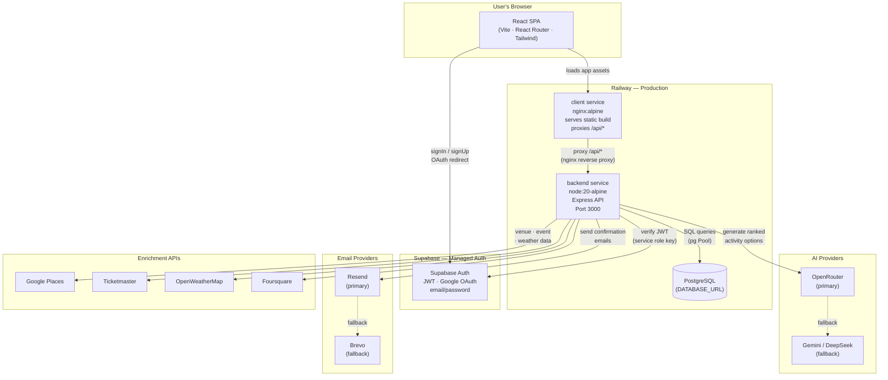
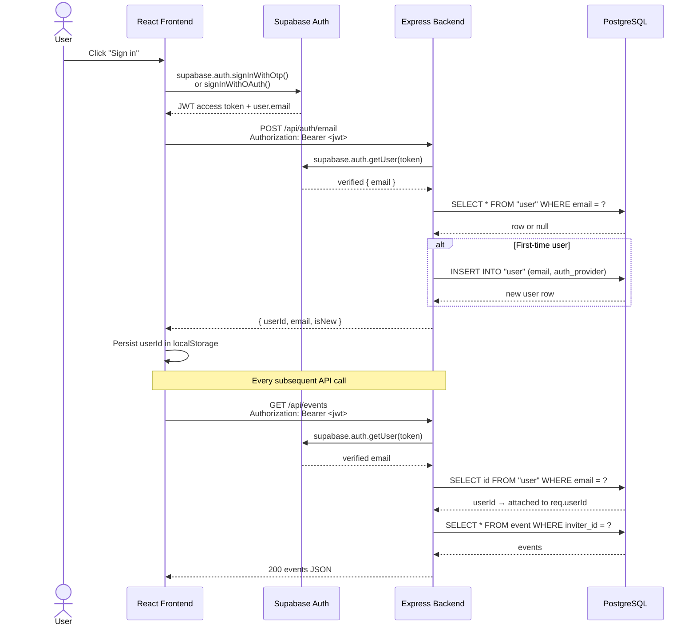
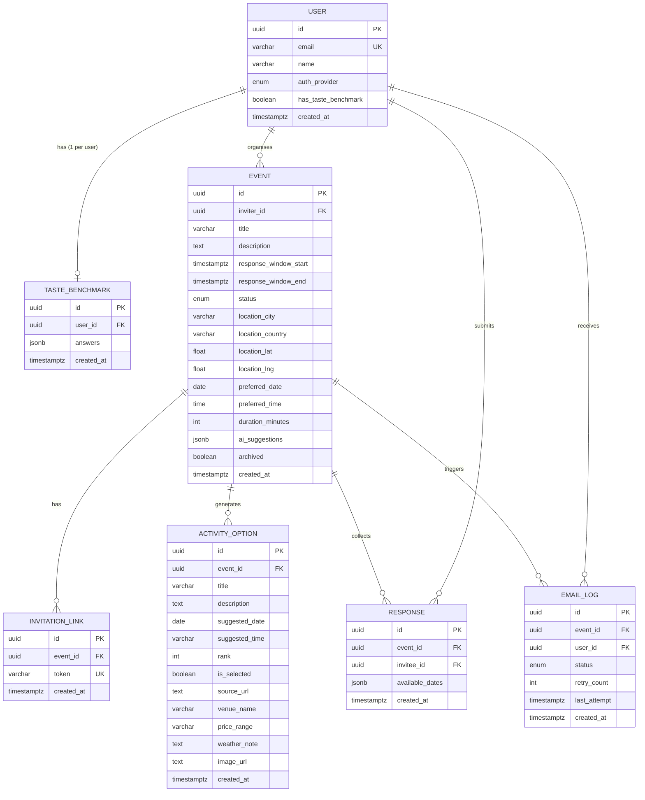
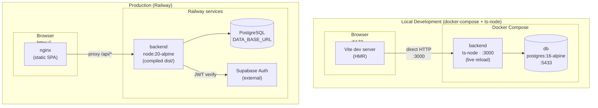
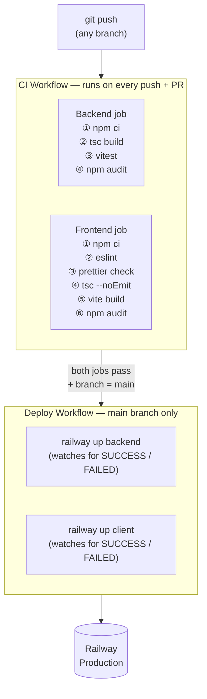

# Go Fish — System Architecture

> **Purpose:** This document explains how all parts of Go Fish fit together — what each service does, how they communicate, how data flows through the system, and how the app is deployed.

---

## Table of Contents

1. [What Go Fish Does](#1-what-go-fish-does)
2. [High-Level System Overview](#2-high-level-system-overview)
3. [Service Descriptions](#3-service-descriptions)
4. [Authentication Flow](#4-authentication-flow)
5. [Data Model](#5-data-model)
6. [API Routes](#6-api-routes)
7. [Local Development vs Production](#7-local-development-vs-production)
8. [CI/CD Pipeline](#8-cicd-pipeline)
9. [Startup Sequence](#9-startup-sequence)

---

## 1. What Go Fish Does

Go Fish solves the "where do we go?" problem for groups. One person creates an event, shares a single invite link, and the app collects everyone's availability and activity preferences. An AI model ranks activity suggestions based on the group's overlap, and the organiser picks one — triggering a confirmation email to all participants.

**Core workflow:**

```
Organiser                 Invitees                   AI / Email
─────────                 ────────                   ──────────
Create event  ──────────► Accept invite
Share link                Submit availability
                          Complete taste benchmark
                                                      Generate ranked options
Review options
Pick final option ──────────────────────────────────► Send confirmation emails
```

---

## 2. High-Level System Overview



---

## 3. Service Descriptions

### 3.1 client (nginx)

| Property | Value |
|---|---|
| Technology | nginx:alpine + static React/Vite build |
| Responsibility | Serve the compiled SPA and proxy all `/api/*` traffic to the backend |
| Port | 3000 (internal Railway) |
| Build | Multi-stage Docker build: Node 20 compiles TypeScript + Vite, output copied to nginx |
| Key file | `client/nginx.conf.template` |

The nginx config has two location blocks:

```nginx
location /api {
    proxy_pass ${BACKEND_URL};   # → backend service
}
location / {
    try_files $uri /index.html;  # SPA fallback
}
```

This means the browser only ever talks to **one hostname**. There are no CORS issues because `/api` is a same-origin proxy, not a cross-origin request.

---

### 3.2 backend (Express API)

| Property | Value |
|---|---|
| Technology | Node.js 20, Express 4, TypeScript |
| Responsibility | All business logic, data persistence, auth verification, AI orchestration, email dispatch |
| Port | 3000 |
| Build | `tsc` compiles `src/` → `dist/`, run with `node dist/index.js` |
| Key file | `src/app.ts` (route mounting), `src/index.ts` (startup) |

**Route map:**

| Prefix | Router | Purpose |
|---|---|---|
| `/api/auth` | `authRouter` | Sign-in, profile CRUD |
| `/api/events` | `eventRouter` | Create / list / update events |
| `/api/events/:id/responses` | `responseRouter` | Invitee availability |
| `/api/invite` | `inviteRouter` | Resolve invite tokens |
| `/api/taste-benchmark` | `tasteBenchmarkRouter` | Preference questionnaire |
| `/health` | inline | Health check (no auth) |
| `*` | static files | Serves `client/dist` if present (used when frontend is co-located) |

---

### 3.3 PostgreSQL

| Property | Value |
|---|---|
| Technology | PostgreSQL 16 |
| Local | `postgres:16-alpine` Docker container, port 5433 |
| Production | Injected via `DATABASE_URL` environment variable (Railway plugin or Supabase) |
| Schema management | Custom SQL migration runner (`src/db/migrate.ts`) |
| Connection | `pg.Pool` with 5-attempt exponential retry (`src/db/connection.ts`) |

Migrations live in `src/db/migrations/` and are applied automatically on every startup. Applied migrations are tracked in a `schema_migrations` table so each file runs exactly once.

---

### 3.4 Supabase Auth (external)

| Property | Value |
|---|---|
| Technology | Supabase managed service |
| Purpose | Credential storage, JWT issuance, Google OAuth |
| Frontend SDK | `@supabase/supabase-js` (anon key, safe to expose) |
| Backend SDK | `@supabase/supabase-js` (service role key, server-side only) |

Supabase issues a signed JWT on login. The backend verifies every request by calling `supabase.auth.getUser(token)` — it never trusts the token payload without server-side validation.

> **Why Supabase instead of rolling our own auth?**
> Supabase handles password hashing, session management, OAuth redirect flows, and token rotation. None of that complexity lives in Go Fish's codebase.

---

### 3.5 AI (OpenRouter / LangChain)

The backend uses LangChain + LangGraph to orchestrate a multi-step decision agent (`src/services/decisionAgent/`). The agent:

1. Reads the event's collected responses and taste benchmarks.
2. Optionally fetches real-world data (venues, events, weather) from enrichment APIs.
3. Calls an LLM (via OpenRouter) to produce 1–3 ranked `activity_option` rows.

OpenRouter is a unified gateway — swapping the underlying model (DeepSeek, Gemini, etc.) requires only an env-var change.

---

### 3.6 Email (Resend / Brevo)

The backend's `emailService` (`src/services/emailService.ts`) sends transactional emails when an event is finalised. It writes an `email_log` row per recipient and retries up to 3 times on failure.

---

## 4. Authentication Flow



**Key design points:**

- The backend **never** stores or trusts the Supabase `auth.uid`. It maintains its own `user.id` (UUID) in PostgreSQL and maps Supabase sessions to it via email.
- In local dev / CI, when `SUPABASE_URL` is absent, the middleware falls back to trusting an `x-user-id` header. This lets tests run without a live Supabase project.

---

## 5. Data Model



**Enum values:**

| Enum | Values |
|---|---|
| `auth_provider` | `google`, `email` |
| `event_status` | `collecting` → `generating` → `options_ready` → `finalized` |
| `email_status` | `pending`, `sent`, `failed` |

---

## 6. API Routes

```
GET    /health                                     # liveness probe (no auth)

POST   /api/auth/email                             # upsert user from Supabase JWT
GET    /api/auth/me                                # current user profile
PATCH  /api/auth/me                                # update name
GET    /api/auth/storage-info                      # event / response counts

GET    /api/events                                 # list organiser's events
POST   /api/events                                 # create event
GET    /api/events/:id                             # get event detail
PATCH  /api/events/:id                             # update event
DELETE /api/events/:id                             # archive event
POST   /api/events/:id/generate-options            # trigger AI option generation
POST   /api/events/:id/finalize                    # select winner + send emails

GET    /api/events/:id/responses                   # list responses for event
POST   /api/events/:id/responses                   # submit invitee response

GET    /api/invite/:token                          # resolve invite token → event
POST   /api/invite/:token/join                     # join event as invitee

GET    /api/taste-benchmark                        # get current user's benchmark
POST   /api/taste-benchmark                        # create / update benchmark
```

All routes except `/health` and `/api/invite/:token` (GET) require `Authorization: Bearer <supabase-jwt>`.

---

## 7. Local Development vs Production



| Aspect | Local | Production |
|---|---|---|
| Frontend | Vite dev server (port 5173, HMR) | nginx serving compiled static files |
| Backend | `ts-node` with live reload | `node dist/index.js` (compiled JS) |
| Database | Docker `postgres:16-alpine` on port 5433 | Railway PostgreSQL via `DATABASE_URL` |
| Auth | `x-user-id` header fallback (no Supabase needed) | Supabase JWT verification |
| Networking | Browser → Vite `:5173`, Vite → backend `:3000` | Browser → nginx, nginx proxies `/api` to backend |
| Config | `.env` file | Railway environment variables |
| Startup | `./start.sh` | `npm start` (`node dist/index.js`) |

### Why nginx in production instead of the Express static server?

Express can serve `client/dist` (and does, when `client/dist` exists), but in Railway the `client` and `backend` are **separate services** on separate containers. nginx is lighter for static file serving and handles the `/api` proxy at the edge — the backend container never touches static assets.

---

## 8. CI/CD Pipeline



**Rules:**

- Every push to **any branch** triggers the CI workflow (build + test + audit).
- The deploy workflow only fires when:
  1. CI passed, **and**
  2. The push was to `main`, **and**
  3. It came from the canonical repository (not a fork).
- Both `backend` and `client` services are deployed **in parallel** as a matrix job.
- The deploy job polls Railway's deployment API until it sees `SUCCESS`, `FAILED`, or `CRASHED` — it does not just fire-and-forget.

---

## 9. Startup Sequence

When the backend container starts (`node dist/index.js`):

```
1. Load .env / environment variables (dotenv)
2. connectWithRetry()
   ├─ Create pg.Pool pointing at DATABASE_URL
   └─ Retry up to 5× (3 s gap) until a connection is acquired
3. runMigrations(pool)
   ├─ CREATE TABLE IF NOT EXISTS schema_migrations
   ├─ Read applied filenames from schema_migrations
   ├─ Read *.sql files from dist/db/migrations/ (sorted)
   └─ For each unapplied file:
       BEGIN → execute SQL → INSERT schema_migrations → COMMIT
4. mountRoutes(pool)
   └─ Attach all Express routers (each receives the pool)
5. app.listen(PORT)
   └─ "Go Fish backend listening on port 3000"
```

If step 2 fails after all retries, the process exits with code 1 and Railway restarts it (configured as `ON_FAILURE` in `railway.json`).
